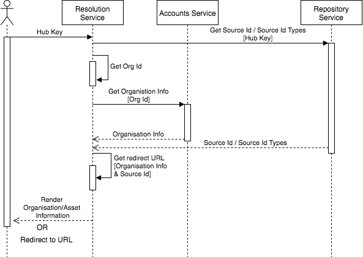
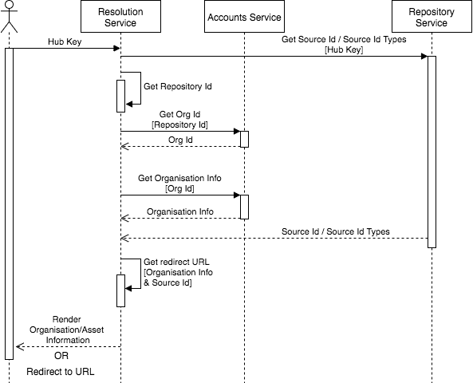

# Resolution Service Low Level Design

##Overview

An Open Permissions Platform hub key can be resolved in one of three ways

1. Redirect to a page displaying specific asset information
2. Redirect to a page displaying generic organisation information
2. Render information about the asset and its organisation

The resolution process used is determined by the Reference Links set up for an organisation.

## Resolution Process
Due to the differences in schema between S0 and S1 Hub Keys, organisation information is retrieved slightly differently when resolving S0 Hub Keys
versus S1 Hub Keys.

###S0 Hub Key Resolution Process

###S1 Hub Key Resolution Process

##Reference Links
Reference Links can be set and retrieved for an Organisation via the [Accounts Service](https://github.com/openpermissions/accounts-srv). 
They are stored as a dictionary of key-value pairs that map a 
[Source Id Type](https://github.com/openpermissions/support-docs/blob/master/documents/markdown/types/source-id-types.md) to a formattable URL. 

A **Redirect Id Type** value can optionally be provided that corresponds to a key within the reference links dictionary.

### Example
    "reference_links": {
        "links": {
            "examplepictureid": "https://example.com?source_id={source_id}",
            "anotherpictureid": "https://anotherexample.com"
        },
        "redirect_id_type" : "examplepictureid"
    }

More information about reference links can be found in the [Accounts Service API Documentation](https://github.com/openpermissions/accounts-srv/blob/master/documents/apiary/api.md)

## Hub Key Resolution
When the resolution service receives a hub key, it will look up:

1. Organisation information for the provider of the asset represented by the hub key (From the [Accounts Service](https://github.com/openpermissions/accounts-srv))
1. A list of valid Source Ids and Source Id Types for the asset represented by the hub key. (From the [Repository Service](https://github.com/openpermissions/repository-srv))

From the organisation information, it will determine whether there is a Redirect Id Type provided as part of the reference links.

If a Redirect Id Type is provided, then the resolution service will **Redirect**

If a Redirect Id Type is not provided (or the asset does not have a Source Id Type that matches the provided Redirect Id Type), 
then the resolution service will **Render**

### Redirect
The Redirect Id Type is used to look up the reference link to redirect to. 
The reference link must be a valid url, and allows for use of the source id within the url structure.
Once the reference link has been formatted, the resolution service will redirect to this url.

###Example
#### Redirect to an asset-specific page

    Asset 
    [{
        source_id_type: 'examplepictureid',
        source_id: 'ID-1234'
    }, {
        source_id_type: 'anotherpictureid',
        source_id: 'ID-5678'
    }]
    

    "reference_links": {
        "links": {
            "examplepictureid": "https://example.com?source_id={source_id}",
            "anotherpictureid": "https://anotherexample.com"
        },
        "redirect_id_type" : "examplepictureid"
    }

    Redirect URL >> https://example.com?source_id=ID-1234

#### Redirect to a generic organisation page

    Asset 
    [{
        source_id_type: 'examplepictureid',
        source_id: 'ID-1234'
    }, {
        source_id_type: 'anotherpictureid',
        source_id: 'ID-5678'
    }]
    
    "reference_links": {
        "links": {
            "examplepictureid": "https://example.com?source_id={source_id}",
            "anotherpictureid": "https://anotherexample.com"
        },
        "redirect_id_type" : "anotherpictureid"
    }

    Redirect URL >> https://anotherexample.com

### Render
The resolution service will render information about the Organisation the Asset belongs to. If information about the 
Asset can be retrieved (e.g. thumbnail image or brief description) then this will also be rendered.
